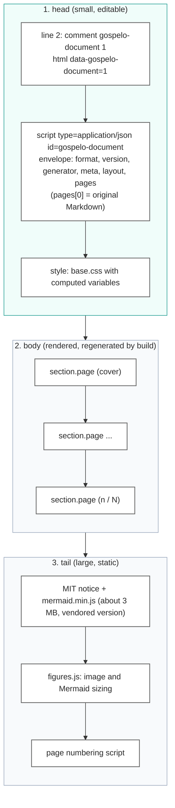
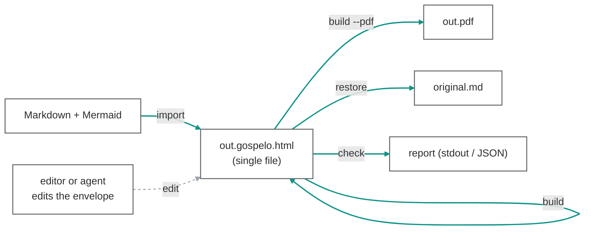
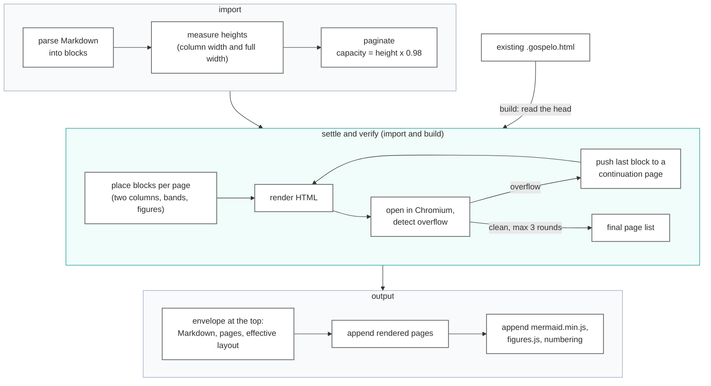
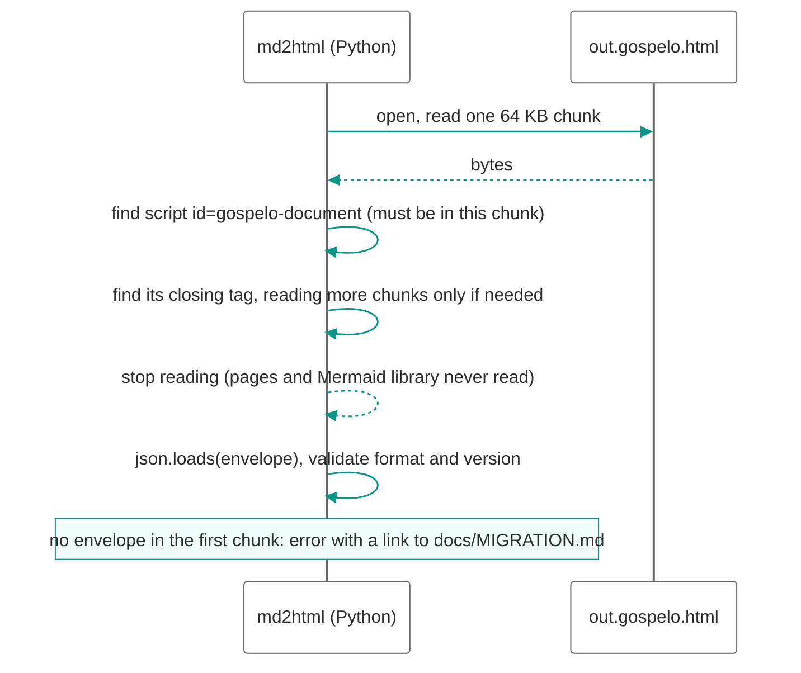
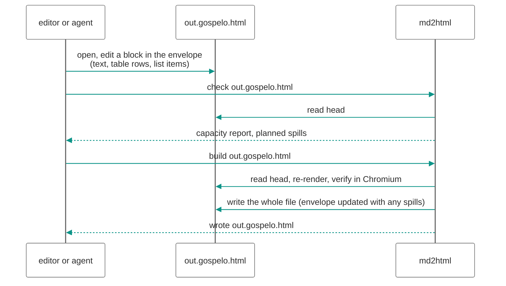

# Single-file HTML architecture

md2html ships one artifact: a **Gospelo Document**, a `.gospelo.html` file. The same file is the deliverable people read, the source that people and agents edit, and the input the tool rebuilds from. This document describes the architecture built around that single file: how the file is laid out, how data flows through `import`, `build`, `check` and `restore`, why the editable data sits at the top of the file, and what the tool does and does not read.

The format itself (envelope object, container rules, conformance) is specified in `docs/spec/gospelo-document.md`. This architecture is implemented as of gospelo-md2html 0.2.0.

## 1. Goals

| Goal | Consequence |
| --- | --- |
| Distribute one file | No sidecar JSON, no external Mermaid library, no external scripts. Only images referenced by path stay external unless embedded. |
| Editable without the tool | The content that determines every page is plain JSON inside the file, placed where an editor or an agent finds it first. |
| Rebuildable from the file alone | `build out.gospelo.html` regenerates the rendered pages from the embedded envelope. The original Markdown is kept inside for `restore`. |
| Cheap to read | The tool reads only the head of the file to get the envelope. The multi-megabyte Mermaid library at the end is never parsed by Python. |
| Reviewable diffs | The envelope is pretty-printed and the rendered pages carry one block per line, so a change to one paragraph shows as a few changed lines in version control. |

## 2. File layout

The file is ordered so that everything a human or a program needs first comes first, and everything large and static comes last.

| Part | Notes |
| --- | --- |
| Signature | `<!-- gospelo-document 1 -->` on line 2 and `data-gospelo-document="1"` on `<html>`, so the format is recognisable from the first bytes regardless of the extension. |
| One envelope block, first in `<head>` | Before every `<style>` and every other `` after the opening tag is its real end.
- The Markdown source is a JSON string inside the envelope, so the same escaping covers it.

## 3. Data flow

### 3.1 Commands

| Command | Input | Output |
| --- | --- | --- |
| `import` | Markdown | `<name>.gospelo.html` (paginated, verified). `-o name.gospelo.json` writes the sidecar form instead. |
| `build` | `.gospelo.html` or `.gospelo.json` | the same HTML rewritten in place (or `-o` elsewhere; a JSON input produces `<name>.gospelo.html`), optional PDF |
| `build --reflow` | same | all pages re-paginated from scratch |
| `check` | same | capacity report, planned spills; writes nothing |
| `restore` | same | the original Markdown from `pages[0]` |

Files written before 0.2.0 (three blocks `page-0`, `md2html-content`, `md2html-layout` after the Mermaid library, or a bare content JSON) are not read. The tool stops with an error that links to `docs/MIGRATION.md`; `scripts/extract_markdown.py` pulls the Markdown out of any such file so that `import` can generate a Gospelo Document from it.

### 3.2 Inside import and build

Both commands share the same measure, paginate, verify pipeline. Heights are never estimated: blocks are rendered in headless Chromium and measured.

`import` runs the settle-and-verify pass too, so the file it writes is exactly what `build` would produce from it: a later `build` moves nothing. Mermaid diagrams are never pre-rendered. The source text stays in the envelope and the vendored Mermaid.js draws it in the browser, so the diagram remains editable in the final file. The envelope records the Mermaid version used (`layout.mermaidVersion`), and every rebuild uses that version, because figure sizes and therefore pagination depend on it.

## 4. Reading the head only

Because the envelope sits at the top and ends with a known terminator, the tool reads the file as a stream and stops early.

| Aspect | Notes |
| --- | --- |
| Early stop | Implemented in `content.read_head`. Matters when `embedImages` is on or the document is long (tens of MB), and bounds memory to the head. |
| No fallback | A file without the envelope in its first chunk is rejected. There is no scan of the whole file and no reader for the earlier block layout. |
| `build` needs nothing beyond the head | The Mermaid library comes from the vendored copy, the pages are regenerated from the envelope. |

## 5. Editing loop

The only supported edit path is the envelope. The rendered DOM is output, not input.

Rules that keep the loop predictable:

- `build` starts from the page boundaries in the envelope and only spills overflow to continuation pages (`id-2`, `id-3`, `continued: true`). It never pulls content back to an earlier page. Use `--reflow` to re-paginate everything.
- Spills are written back into the envelope of the same file, so the envelope and the pages never disagree.
- Layout (page size, font size, columns, Mermaid version) lives in `layout` and CLI options. Content never carries layout except per-page or per-block `layout.overrides`.

## 6. Diffs and version control

- The envelope is pretty-printed (two-space indent, one key per line). A one-paragraph edit shows as a few changed lines.
- The Mermaid library is a fixed vendored version, so it never appears in a diff.
- Rendered pages carry one block per line, so a diff of the rendered part is block-sized. Review is still expected on the envelope side.
- Content appears twice (envelope and DOM). This is by design: the DOM is derived and regenerated, and the duplication is what makes the file viewable without the tool.

## 7. Trade-offs

| Topic | Trade-off | Position |
| --- | --- | --- |
| File size | Embedding Mermaid.js adds about 3 MB per file. | Accepted for single-file distribution. `--mermaid-lib link` remains for cases where many files share one library (`mermaid-<version>.min.js` next to the file). The library is omitted when the document has no Mermaid block. |
| Multiple page formats | One file holds one layout. Producing A4 and 16:9 from the same content means two files. | Accepted. Rebuild with `build --page a4 --reflow` from either file; the envelope content is the same. |
| Viewers without JavaScript | GitHub preview and some viewers do not run scripts: Mermaid stays as source, page numbers are static. | Accepted. Distribute the HTML for browsers, or the PDF. |
| Images | Path-referenced images stay external by default. | Use `embedImages` when the file must be fully self-contained. |
| Sidecar JSON | Useful for editing outside the HTML and for small diffs. | Optional output only (`.gospelo.json`, the same envelope). Not part of the distributed artifact. |
| Earlier formats | Reading them would keep two code paths alive. | Not read. Migration is re-import from the Markdown, which every earlier file still contains (`docs/MIGRATION.md`). |

## 8. Where things live

| Concern | Location |
| --- | --- |
| Envelope model, head reader, validation | `scripts/md2html/content.py` |
| Container rendering (head, pages, tail) | `scripts/md2html/render.py` |
| Commands and default paths | `scripts/md2html.py` |
| Per-version Mermaid vendoring and license notice | `scripts/md2html/assets.py`, `references/vendor/mermaid/<version>/` |
| Envelope schema (ships with the skill) | `references/gospelo-document.schema.json` |
| Format specification | `docs/spec/gospelo-document.md` |
| Migration from earlier files | `docs/MIGRATION.md`, `scripts/extract_markdown.py` |

Everything else (measurement, pagination rules, two-column layout, figure sizing, verification) is described in `development/docs/`, and the design rationale with its sources in `development/docs/design/`.
