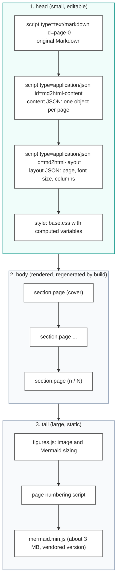
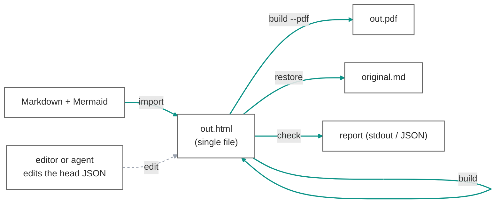
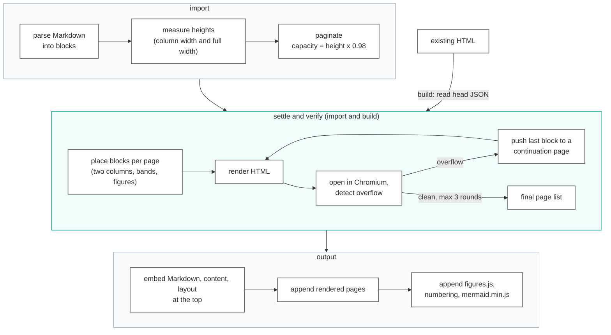
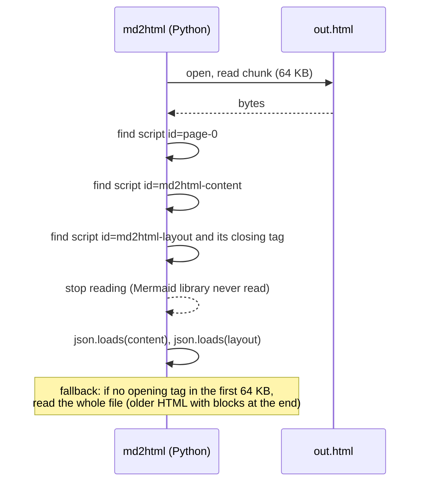
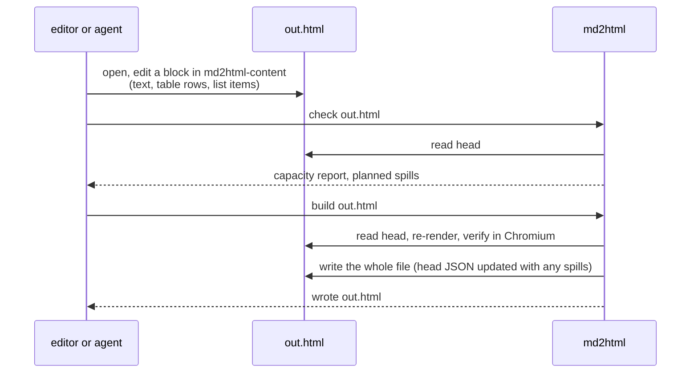

# Single-file HTML architecture

md2html ships one artifact: an HTML file. The same file is the deliverable people read, the source that people and agents edit, and the input the tool rebuilds from. This document describes the architecture optimized around that single file: how the file is laid out, how data flows through `import`, `build`, `check` and `restore`, why the editable data sits at the top of the file, and what changes from the current implementation.

Status of each part is marked as **current** (already implemented) or **target** (the change this architecture calls for).

## 1. Goals

| Goal | Consequence |
| --- | --- |
| Distribute one file | No sidecar JSON, no external Mermaid library, no external scripts. Only images referenced by path stay external unless embedded. |
| Editable without the tool | The content that determines every page is plain JSON inside the file, placed where an editor or an agent finds it first. |
| Rebuildable from the file alone | `build out.html` regenerates the rendered pages from the embedded JSON. The original Markdown is kept inside for `restore`. |
| Cheap to read | The tool reads only the head of the file to get the JSON. The multi-megabyte Mermaid library at the end is never parsed by Python. |
| Reviewable diffs | The JSON is pretty-printed, so a change to one paragraph shows as a few changed lines in version control. |

## 2. File layout

The file is ordered so that everything a human or a program needs first comes first, and everything large and static comes last.

| Part | Status | Notes |
| --- | --- | --- |
| Three embedded blocks (Markdown, content, layout) | current | Present in every generated HTML. `check`, `build` and `restore` already accept an `.html` input and read these blocks. |
| Blocks placed at the top of the file | target | Today the blocks come after the Mermaid library: in a 3.1 MB file the content JSON starts at byte 3.03 M. Moving them under `<head>` puts the editable data in the first few hundred lines. |
| Mermaid library at the end of `<body>` | target | Mermaid initializes after DOM construction, so moving the library does not change rendering. |
| Rendered pages regenerated on every build | current | The DOM is derived data. Editing it directly is not supported. |

### 2.1 Escaping rules

The head blocks must be safe to embed and easy to find:

- JSON is written with `<` escaped as `\u003c` (`embed_json`). No `</script` sequence can occur inside a JSON block, so the first `</script>` after a block's opening tag is its real end. **current**
- The Markdown block must follow the same rule, because a Markdown source may legitimately contain `</script>`. **target** (verify the current escaping of `page-0`)
- The three blocks always appear in the fixed order Markdown, content, layout. A reader can stop at the end of the layout block. **target**

## 3. Data flow

### 3.1 Commands

| Command | Input | Output | Status |
| --- | --- | --- | --- |
| `import` | Markdown | HTML (paginated, verified) | target. Today `import` writes a content JSON and discards the HTML string it already produced in its settle pass. The change is to write that string when the output path ends in `.html`, and to write JSON only when a `.json` path is given explicitly. |
| `build` | HTML | the same HTML, rewritten in place (or `-o` elsewhere), optional PDF | current |
| `build --reflow` | HTML | HTML with all pages re-paginated from scratch | current |
| `check` | HTML | capacity report, planned spills; writes nothing | current |
| `restore` | HTML | the original Markdown from `page-0` | current |

### 3.2 Inside import and build

Both commands share the same measure, paginate, verify pipeline. Heights are never estimated: blocks are rendered in headless Chromium and measured.

Mermaid diagrams are never pre-rendered. The source text stays in the content JSON and the vendored Mermaid.js draws it in the browser, so the diagram remains editable in the final file.

## 4. Reading the head only

Because the editable blocks sit at the top and end with a known terminator, the tool can read the file as a stream and stop early.

| Aspect | Status | Notes |
| --- | --- | --- |
| Extraction by id with a regular expression | current | Position independent. Works for both the old and the new block order. |
| Whole-file read | current | 3.1 MB: read 6 ms, extract and parse 2.4 ms. Acceptable today. |
| Streaming read with early stop | target | Matters when `embedImages` is on or the document is long (tens of MB). Also bounds memory to the head. |

`build` needs nothing beyond the head: the Mermaid library is taken from the vendored copy, and the pages are regenerated from the content JSON.

## 5. Editing loop

The only supported edit path is the embedded content JSON. The rendered DOM is output, not input.

Rules that keep the loop predictable:

- `build` starts from the page boundaries in the JSON and only spills overflow to continuation pages (`id-2`, `id-3`, `continued: true`). It never pulls content back to an earlier page. Use `--reflow` to re-paginate everything.
- Spills are written back into the head JSON of the same file, so the JSON and the pages never disagree.
- Layout (page size, font size, columns) lives in the layout block and CLI options. Content never carries layout except per-page `overrides`.

## 6. Diffs and version control

- The JSON blocks are pretty-printed (two-space indent, one key per line). A one-paragraph edit shows as a few changed lines.
- The Mermaid library is a fixed vendored version, so it never appears in a diff.
- Rendered pages are currently emitted as one `<section>` per line (the longest line in the sample is about 320 K characters). A small edit changes the whole line of that page. **target**: emit a newline between blocks inside a section so diffs of the rendered part are block-sized. Review is still expected on the JSON side.
- Content appears twice (JSON and DOM). This is by design: the DOM is derived and regenerated, and the duplication is what makes the file viewable without the tool.

## 7. Trade-offs

| Topic | Trade-off | Position |
| --- | --- | --- |
| File size | Embedding Mermaid.js adds about 3 MB per file. | Accepted for single-file distribution. `--mermaid-lib link` remains for cases where many files share one library. The library is omitted when the document has no Mermaid block. |
| Multiple page formats | One HTML holds one layout. Producing A4 and 16:9 from the same content means two HTML files. | Accepted. Rebuild with `build --page a4 --reflow` from either file; the content JSON is the same. |
| Viewers without JavaScript | GitHub preview and some viewers do not run scripts: Mermaid stays as source, page numbers are static. | Accepted. Distribute the HTML for browsers, or the PDF. |
| Images | Path-referenced images stay external by default. | Use `embedImages` when the file must be fully self-contained. |
| Sidecar JSON | Useful for editing outside the HTML and for small diffs. | Optional output only. Not part of the distributed artifact. |

## 8. What changes from the current implementation

| Change | Where | Size |
| --- | --- | --- |
| `import` writes HTML when the output ends in `.html`; JSON only on explicit `.json` | `scripts/md2html.py`, `cmd_import` | small: the HTML string already exists in the settle pass |
| Block order: head JSON first, Mermaid library last | `scripts/md2html/render.py` | small |
| Escape `</script>` in the Markdown block the same way as JSON | `scripts/md2html/content.py`, `render.py` | small |
| Streaming loader with early stop and whole-file fallback | `scripts/md2html/content.py` (`load_content`, `load_embedded_layout`) | small |
| `meta.source` relative to the HTML, not to a JSON | `scripts/md2html.py` | one line |
| Newline between blocks inside rendered sections | `scripts/md2html/render.py` | small |
| Workflow text: `import` produces HTML, then `check` and `build` on the HTML | `SKILL.md`, `references/editing_guide.md`, `README.md`, `docs/QUICKSTART.md` | documentation |

Everything else (measurement, pagination rules, two-column layout, figure sizing, verification) is unchanged. See `development/docs/` for the pipeline and layout logic, and `development/docs/design/` for the design rationale and its sources.
