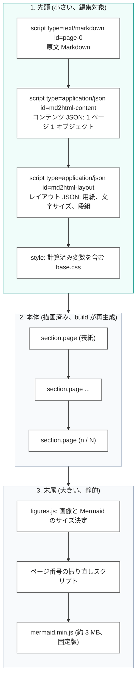
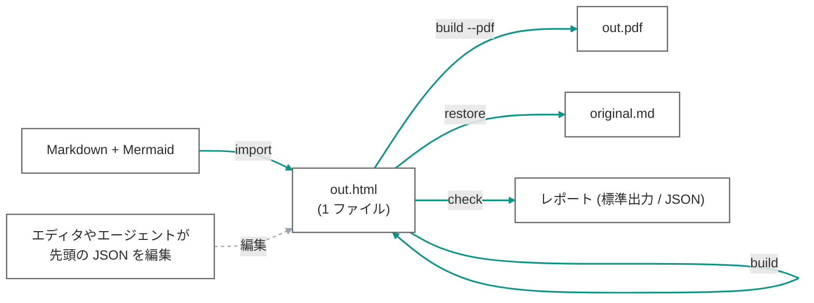
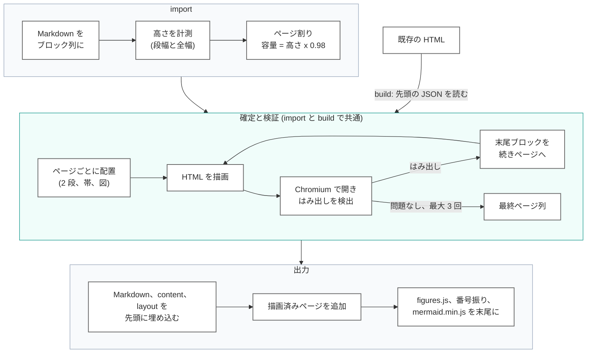
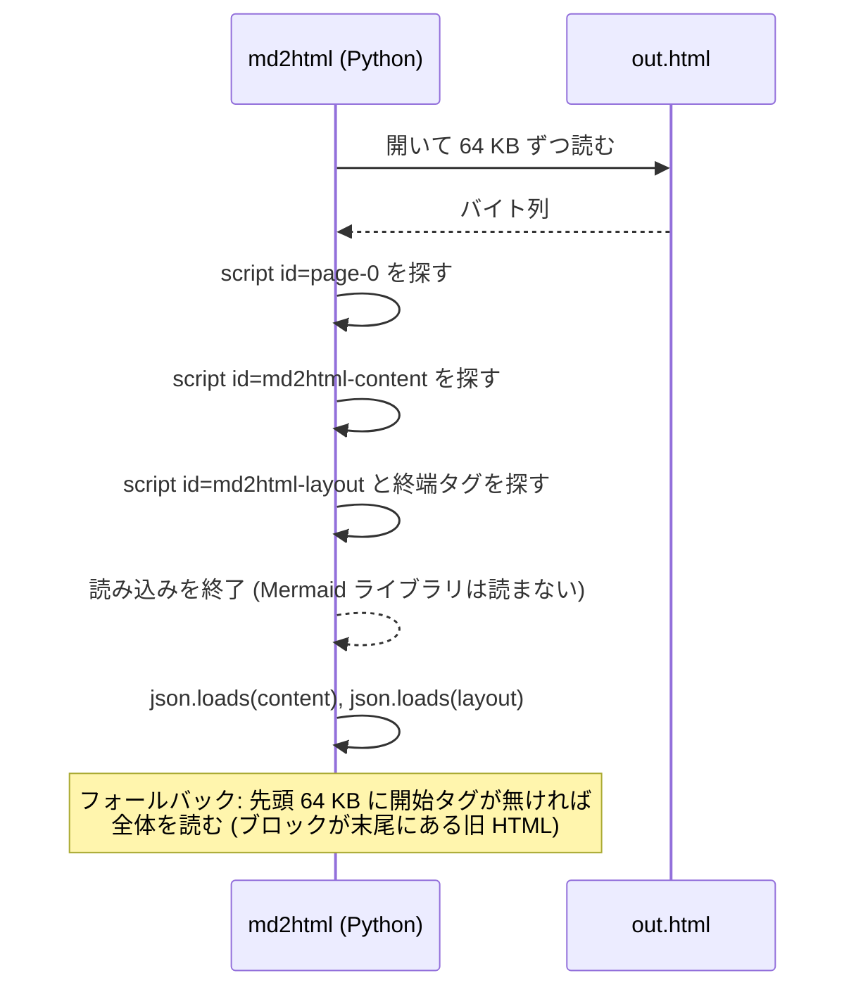
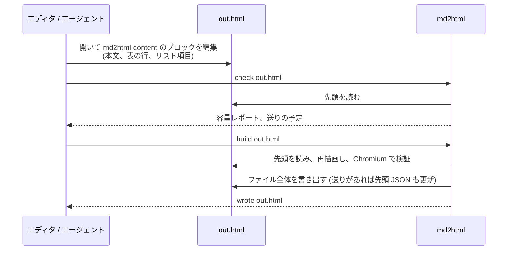

# HTML 1 ファイルのアーキテクチャ

md2html の成果物は HTML ファイル 1 つである。読む人に配る配布物、人やエージェントが編集する原稿、ツールが再生成するときの入力が、すべて同じ 1 ファイルになる。本書はこの「1 ファイル」を中心に最適化したアーキテクチャを説明する。ファイルの内部配置、`import` / `build` / `check` / `restore` のデータの流れ、編集対象の JSON をファイル先頭に置く理由、そして現在の実装から何を変えるかをまとめる。

各項目には **現状** (実装済み) と **目標** (このアーキテクチャで変える点) を付す。

## 1. 目標

| 目標 | 帰結 |
| --- | --- |
| 配布物は 1 ファイル | 付随する JSON、外部の Mermaid ライブラリ、外部スクリプトを持たない。パス参照の画像だけは、埋め込みを指定しない限り外部に残る |
| ツールが無くても編集できる | 全ページを決めるコンテンツは素の JSON としてファイル内にあり、エディタやエージェントが最初に目にする位置に置く |
| そのファイルだけで再生成できる | `build out.html` が埋め込み JSON から描画済みページを作り直す。原文 Markdown も内部に保持し `restore` で取り出せる |
| 読み込みが軽い | ツールはファイルの先頭だけを読んで JSON を得る。末尾にある数 MB の Mermaid ライブラリを Python が解析することはない |
| 差分が読める | JSON は整形して埋め込むため、1 段落の変更は数行の差分として版管理に現れる |

## 2. ファイルの配置

人やプログラムが最初に必要とするものを前に、大きくて静的なものを後ろに置く。

| 部分 | 状態 | 備考 |
| --- | --- | --- |
| 3 つの埋め込みブロック (Markdown、content、layout) | 現状 | 生成 HTML すべてに含まれる。`check`、`build`、`restore` はすでに `.html` を入力に取り、これらを読む |
| ブロックをファイル先頭に置く | 目標 | 現在は Mermaid ライブラリの後ろにあり、3.1 MB のファイルでは content JSON が 3.03 MB 地点から始まる。`<head>` 直下に移すと編集対象が先頭数百行に収まる |
| Mermaid ライブラリを `<body>` 末尾へ | 目標 | Mermaid は DOM 構築後に初期化されるので、位置を変えても描画は変わらない |
| 描画済みページは build のたびに再生成 | 現状 | DOM は派生データであり、直接編集は対象外 |

### 2.1 エスケープの規則

先頭ブロックは、安全に埋め込めて、簡単に見つけられなければならない。

- JSON は `<` を `\u003c` にエスケープして書く (`embed_json`)。JSON の中に `</script` が現れないので、開始タグの後に最初に出る `</script>` がそのブロックの終端である。**現状**
- Markdown ブロックにも同じ規則を適用する。原文 Markdown には `</script>` が正当に書かれ得るため。**目標** (現在の `page-0` のエスケープを確認する)
- 3 ブロックは常に Markdown、content、layout の順で並ぶ。読み手は layout の終端で読むのをやめてよい。**目標**

## 3. データの流れ

### 3.1 コマンド

| コマンド | 入力 | 出力 | 状態 |
| --- | --- | --- | --- |
| `import` | Markdown | HTML (ページ割りと検証済み) | 目標。現在の `import` はコンテンツ JSON を書き、settle パスで生成済みの HTML 文字列を捨てている。出力先が `.html` ならその文字列を書き、JSON は `.json` を明示したときだけ書くように変える |
| `build` | HTML | 同じ HTML を上書き (`-o` で別の場所も可)、任意で PDF | 現状 |
| `build --reflow` | HTML | 全ページを組み直した HTML | 現状 |
| `check` | HTML | 容量レポートと送りの予定。何も書かない | 現状 |
| `restore` | HTML | `page-0` の原文 Markdown | 現状 |

### 3.2 import と build の内部

両コマンドは計測、ページ割り、検証の同じパイプラインを共有する。高さは推定せず、ヘッドレス Chromium で描画して測る。

Mermaid 図は事前描画しない。ソース文字列をコンテンツ JSON に持ち、同梱の Mermaid.js がブラウザで描くので、最終ファイルの中でも図を編集できる。

## 4. 先頭だけを読む

編集対象のブロックが先頭にあり、終端が決まっているので、ツールはファイルをストリームとして読み、途中で止められる。

| 観点 | 状態 | 備考 |
| --- | --- | --- |
| id を手がかりに正規表現で抽出 | 現状 | 位置に依存しない。旧配置でも新配置でも動く |
| ファイル全体を読む | 現状 | 3.1 MB で読み込み 6 ms、抽出と解析 2.4 ms。現時点では十分 |
| ストリーム読みで早期終了 | 目標 | `embedImages` で画像を埋め込んだときや、ページ数が多く数十 MB になったときに効く。メモリも先頭分で済む |

`build` に必要なのは先頭だけである。Mermaid ライブラリは同梱の vendor 版から取り、ページはコンテンツ JSON から再生成する。

## 5. 編集の流れ

サポートする編集経路は埋め込みコンテンツ JSON だけである。描画済み DOM は出力であって入力ではない。

流れを予測可能にする規則:

- `build` は JSON のページ境界を出発点にし、はみ出した分だけを続きページ (`id-2`、`id-3`、`continued: true`) へ送る。前のページに詰め戻すことはしない。全体を組み直すのは `--reflow` だけ。
- 送りの結果は同じファイルの先頭 JSON に書き戻す。JSON とページが食い違うことはない。
- レイアウト (用紙、文字サイズ、段組) はレイアウトブロックと CLI オプションに置く。コンテンツはページ単位の `overrides` 以外にレイアウトを持たない。

## 6. 差分と版管理

- JSON ブロックは整形済み (2 スペースのインデント、1 行 1 キー)。1 段落の編集は数行の差分になる。
- Mermaid ライブラリは固定版なので差分に現れない。
- 描画済みページは現在 1 `<section>` を 1 行で出している (サンプルの最長行は約 32 万文字)。小さな編集でもそのページの行がまるごと差分になる。**目標**: section 内のブロック間に改行を入れ、描画部分の差分もブロック単位にする。レビューは引き続き JSON 側で行う想定。
- 内容は JSON と DOM の 2 か所に現れる。これは設計どおりで、DOM は派生データとして再生成され、この重複があるからこそツールが無くても閲覧できる。

## 7. トレードオフ

| 論点 | トレードオフ | 立場 |
| --- | --- | --- |
| ファイルサイズ | Mermaid.js の同梱で 1 ファイルあたり約 3 MB 増える | 1 ファイル配布のために受け入れる。多数のファイルで 1 つのライブラリを共有したい場合は `--mermaid-lib link` を残す。Mermaid ブロックが無い文書には同梱しない |
| 複数の用紙 | 1 つの HTML は 1 つのレイアウトしか持たない。同じ内容を A4 と 16:9 で出すなら HTML が 2 つになる | 受け入れる。どちらの HTML からでも `build --page a4 --reflow` で作り直せる。コンテンツ JSON は同じ |
| JavaScript が動かないビューア | GitHub のプレビューなどではスクリプトが動かず、Mermaid はソースのまま、ページ番号は静的値になる | 受け入れる。HTML はブラウザで開く前提とし、それ以外は PDF を配る |
| 画像 | パス参照の画像は既定で外部に残る | 完全に自己完結させたい場合は `embedImages` を使う |
| 付随 JSON | HTML の外で編集したい場合や差分を小さくしたい場合には有用 | 任意の出力とする。配布物には含めない |

## 8. 現在の実装から変える点

| 変更 | 場所 | 規模 |
| --- | --- | --- |
| `import` は出力先が `.html` なら HTML を書き、JSON は `.json` 明示時のみ | `scripts/md2html.py` の `cmd_import` | 小。HTML 文字列は settle パスで生成済み |
| ブロック順: 先頭に JSON、末尾に Mermaid ライブラリ | `scripts/md2html/render.py` | 小 |
| Markdown ブロックの `</script>` も JSON と同じ方式でエスケープ | `scripts/md2html/content.py`、`render.py` | 小 |
| 早期終了するストリーム読み込みと全体読みへのフォールバック | `scripts/md2html/content.py` (`load_content`、`load_embedded_layout`) | 小 |
| `meta.source` の相対パスの基準を JSON ではなく HTML に | `scripts/md2html.py` | 1 行 |
| 描画済み section 内のブロック間に改行 | `scripts/md2html/render.py` | 小 |
| ワークフローの記述: `import` で HTML、以後は HTML に対して `check` と `build` | `SKILL.md`、`references/editing_guide.md`、`README.md`、`docs/QUICKSTART.md` | 文書 |

それ以外 (計測、ページ割りの規則、2 段レイアウト、図のサイズ決定、検証) は変わらない。パイプラインとレイアウトロジックは `development/docs/`、設計の根拠と引用元は `development/docs/design/` を参照。
