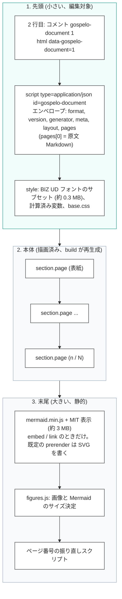
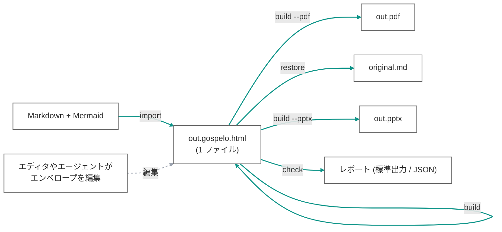
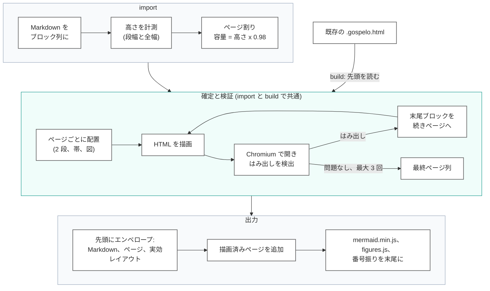
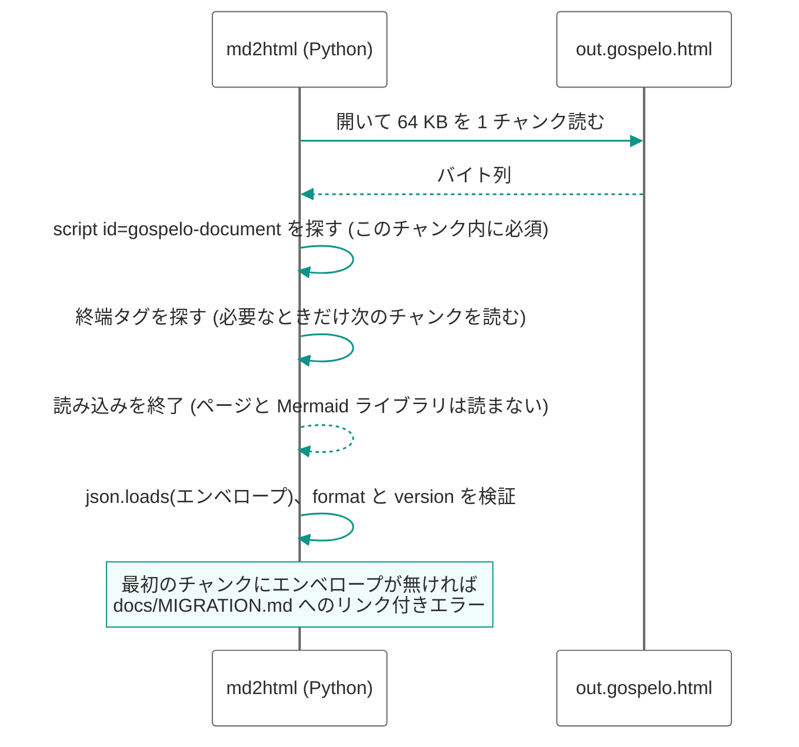
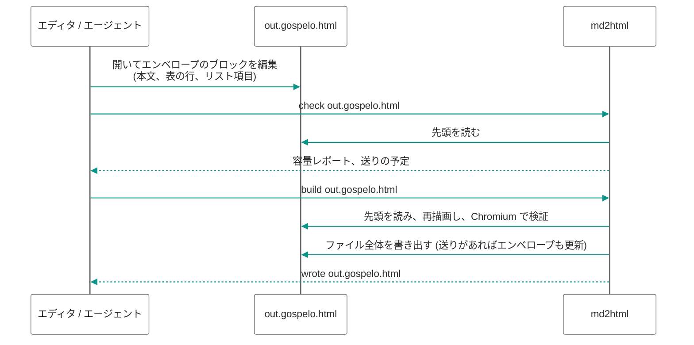

# HTML 1 ファイルのアーキテクチャ

md2html の成果物は **Gospelo Document**、すなわち `.gospelo.html` ファイル 1 つである。読む人に配る配布物、人やエージェントが編集する原稿、ツールが再生成するときの入力が、すべて同じ 1 ファイルになる。本書はこの「1 ファイル」を中心に組んだアーキテクチャを説明する。ファイルの内部配置、`import` / `build` / `check` / `restore` のデータの流れ、編集対象の JSON をファイル先頭に置く理由、ツールが何を読み何を読まないか。

形式そのもの (エンベロープ、コンテナの規則、準拠条件) は `docs/spec/gospelo-document_ja.md` で定義する。本アーキテクチャは gospelo-md2html 0.2.0 で実装済みである。

## 1. 目標

| 目標 | 帰結 |
| --- | --- |
| 配布物は 1 ファイル | 付随する JSON、外部の Mermaid ライブラリ、外部スクリプトを持たない。パス参照の画像だけは、埋め込みを指定しない限り外部に残る |
| ツールが無くても編集できる | 全ページを決めるコンテンツは素の JSON としてファイル内にあり、エディタやエージェントが最初に目にする位置に置く |
| そのファイルだけで再生成できる | `build out.gospelo.html` が埋め込みエンベロープから描画済みページを作り直す。原文 Markdown も内部に保持し `restore` で取り出せる |
| 読み込みが軽い | ツールはファイルの先頭だけを読んでエンベロープを得る。それ以降 (描画済みページ、`embed` のときは数 MB の Mermaid ライブラリ) を Python が解析することはない |
| 差分が読める | エンベロープは整形して埋め込み、描画済みページは 1 ブロック 1 行で出すため、1 段落の変更は数行の差分として版管理に現れる |

## 2. ファイルの配置

人やプログラムが最初に必要とするものを前に、大きくて静的なものを後ろに置く。

| 部分 | 備考 |
| --- | --- |
| 署名 | 2 行目の `<!-- gospelo-document 1 -->` と `<html>` の `data-gospelo-document="1"`。拡張子に関係なく先頭数バイトで形式が分かる |
| エンベロープ 1 ブロック、`<head>` の先頭 | すべての `<style>` と他のすべての `` が終端である。
- 原文 Markdown はエンベロープ内の JSON 文字列なので、同じエスケープで守られる。

## 3. データの流れ

### 3.1 コマンド

| コマンド | 入力 | 出力 |
| --- | --- | --- |
| `import` | Markdown | `<name>.gospelo.html` (ページ割りと検証済み)。`-o name.gospelo.json` なら分離 JSON |
| `build` | `.gospelo.html` または `.gospelo.json` | 同じ HTML を上書き (`-o` で別の場所も可。JSON 入力なら `<name>.gospelo.html`)、任意で PDF (`--pdf`) と PPTX (`--pptx`: 同じ Chromium の描画を 1 ページ 1 枚の画像スライドに、リンク領域と任意の透明テキスト層付き) |
| `build --reflow` | 同上 | 全ページを組み直す |
| `check` | 同上 | 容量レポートと送りの予定。何も書かない |
| `restore` | 同上 | `pages[0]` の原文 Markdown |

0.2.0 より前に書かれたファイル (Mermaid ライブラリの後ろに `page-0`、`md2html-content`、`md2html-layout` の 3 ブロックがある HTML、または素のコンテンツ JSON) は読まない。ツールは `docs/MIGRATION.md` (日本語版 `docs/MIGRATION_ja.md`) へのリンク付きのエラーで止まる。`scripts/extract_markdown.py` がそれらのファイルから Markdown を取り出すので、`import` で Gospelo Document を生成し直せる。

### 3.2 import と build の内部

両コマンドは計測、ページ割り、検証の同じパイプラインを共有する。高さは推定せず、ヘッドレス Chromium で描画して測る。

`import` も確定と検証のパスを通すので、書き出すファイルは `build` がそこから作るものと同一で、後の `build` は何も動かさない。Mermaid 図は検証パスの中で同梱の Mermaid.js が Chromium 上で描く。既定の `prerender` ではその SVG をファイルに書き込みライブラリは同梱しないが、ソース文字列はエンベロープに残るので図は編集できる (ソースを直して `build`)。`embed` と `link` ではソースをページに置き、ブラウザが描く。エンベロープは使った Mermaid の版を記録し (`layout.mermaidVersion`)、再生成は必ずその版で行う。図の寸法、したがってページ割りが版に依存するためである。

## 4. 先頭だけを読む

エンベロープが先頭にあり、終端が決まっているので、ツールはファイルをストリームとして読み、途中で止める。

| 観点 | 備考 |
| --- | --- |
| 早期終了 | `content.read_head` に実装。`embedImages` で画像を埋め込んだときや、数十 MB の長い文書で効き、メモリも先頭分で済む |
| フォールバック無し | 最初のチャンクにエンベロープが無いファイルは拒否する。ファイル全体の走査も、以前のブロック配置の読み手も持たない |
| `build` に必要なのは先頭だけ | Mermaid ライブラリは同梱の vendor 版から取り、ページはエンベロープから再生成する |

## 5. 編集の流れ

サポートする編集経路はエンベロープだけである。描画済み DOM は出力であって入力ではない。

流れを予測可能にする規則:

- `build` はエンベロープのページ境界を出発点にし、はみ出した分だけを続きページ (`id-2`、`id-3`、`continued: true`) へ送る。前のページに詰め戻すことはしない。全体を組み直すのは `--reflow` だけ。
- 送りの結果は同じファイルのエンベロープに書き戻す。エンベロープとページが食い違うことはない。
- レイアウト (用紙、文字サイズ、段組、Mermaid の版) は `layout` と CLI オプションに置く。コンテンツはページ単位・ブロック単位の `layout.overrides` 以外にレイアウトを持たない。

## 6. 差分と版管理

- エンベロープは整形済み (2 スペースのインデント、1 行 1 キー)。1 段落の編集は数行の差分になる。
- Mermaid ライブラリは固定版なので差分に現れない。
- 描画済みページは 1 ブロック 1 行で出すので、描画部分の差分もブロック単位になる。レビューは引き続きエンベロープ側で行う想定。
- 内容はエンベロープと DOM の 2 か所に現れる。これは設計どおりで、DOM は派生データとして再生成され、この重複があるからこそツールが無くても閲覧できる。

## 7. トレードオフ

| 論点 | トレードオフ | 立場 |
| --- | --- | --- |
| ファイルサイズ | Mermaid.js を同梱すると 1 ファイルあたり約 3 MB 増える | 既定の `prerender` は図を SVG として書き、ライブラリを同梱しない (図 5 枚の 15 ページのスライドで約 0.45 MB。大半は `fa:` アイコン用の Font Awesome フォント)。`embed` (ブラウザ描画、約 3 MB) と `link` (隣の `mermaid-<version>.min.js` を共有) は選択肢として残す |
| 複数の用紙 | 1 つのファイルは 1 つのレイアウトしか持たない。同じ内容を A4 と 16:9 で出すならファイルが 2 つになる | 受け入れる。どちらのファイルからでも `build --page a4 --reflow` で作り直せる。エンベロープの内容は同じ |
| JavaScript が動かないビューア | スクリプトが動かない環境ではページ番号が静的値のままになり、`embed` / `link` では Mermaid がソースのまま表示される | 受け入れる。既定の `prerender` では図は素の SVG なので、スクリプト無しでも表示される |
| 画像 | パス参照の画像は既定で外部に残る | 完全に自己完結させたい場合は `embedImages` を使う |
| 分離 JSON | HTML の外で編集したい場合や差分を小さくしたい場合には有用 | 任意の出力 (`.gospelo.json`、同じエンベロープ)。配布物には含めない |
| 以前の形式 | 読めるようにすると 2 つのコード経路を保守することになる | 読まない。移行は Markdown からの再 `import` で、以前のファイルもすべて Markdown を内部に持っている (`docs/MIGRATION_ja.md`) |

## 8. 所在

| 関心事 | 場所 |
| --- | --- |
| エンベロープのモデル、先頭読み込み、検証 | `scripts/md2html/content.py` |
| コンテナの描画 (先頭、ページ、末尾) | `scripts/md2html/render.py` |
| コマンドと既定のパス | `scripts/md2html.py` |
| 版別の Mermaid 同梱とライセンス表示 | `scripts/md2html/assets.py`、`references/vendor/mermaid/<version>/` |
| エンベロープのスキーマ (スキルに同梱) | `references/gospelo-document.schema.json` |
| 形式の仕様 | `docs/spec/gospelo-document_ja.md` |
| 以前のファイルからの移行 | `docs/MIGRATION_ja.md`、`scripts/extract_markdown.py` |

それ以外 (計測、ページ割りの規則、2 段レイアウト、図のサイズ決定、検証) は `development/docs/`、設計の根拠と引用元は `development/docs/design/` に置く。
