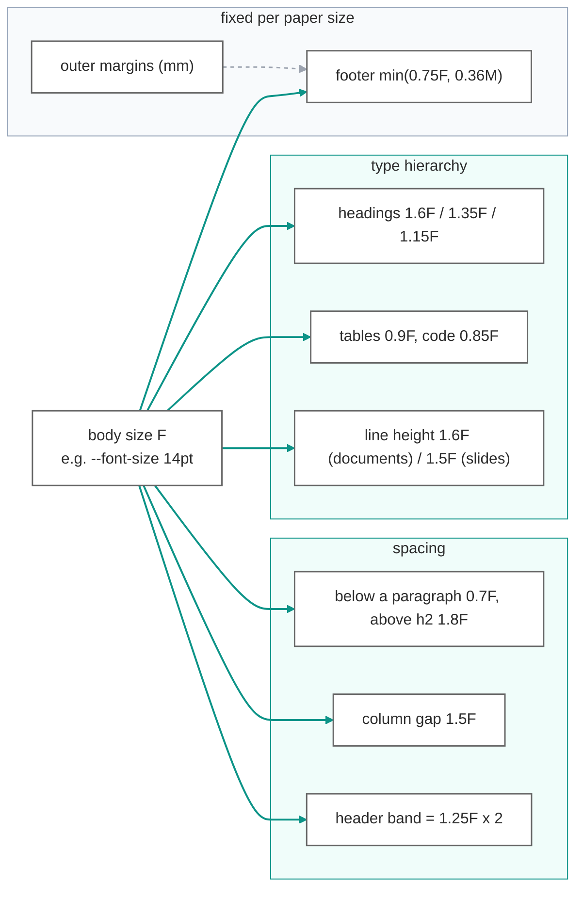
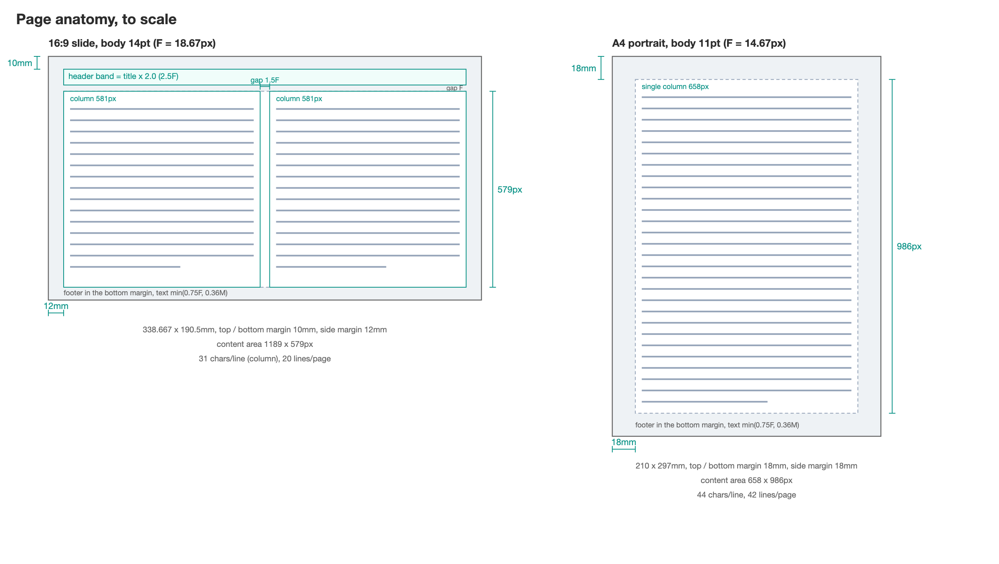
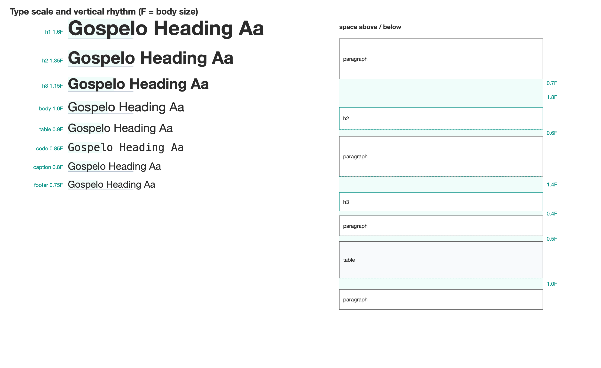
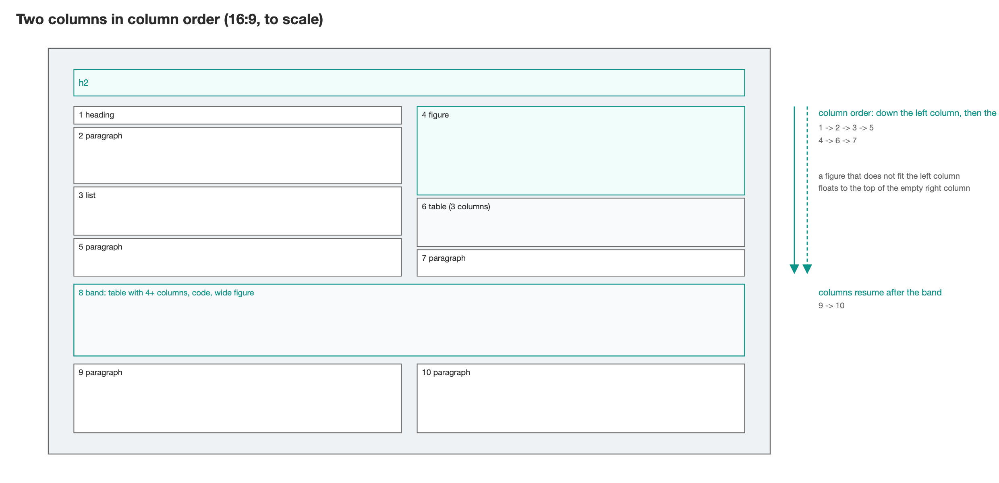
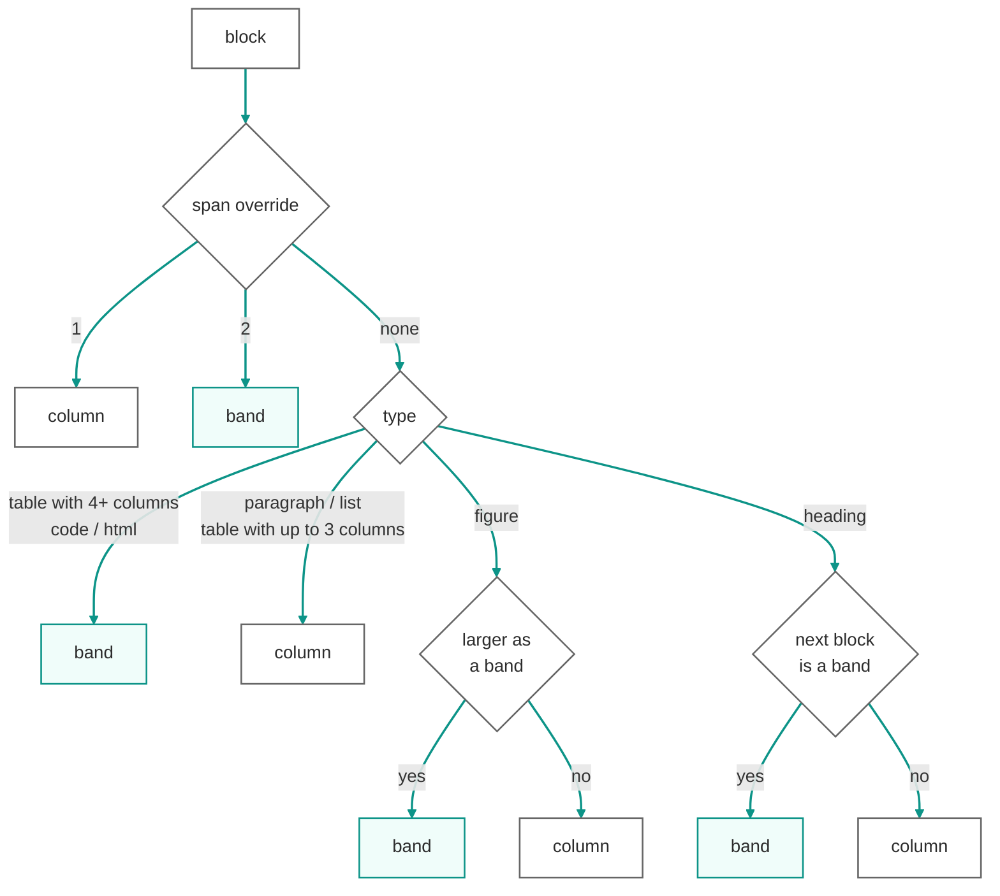
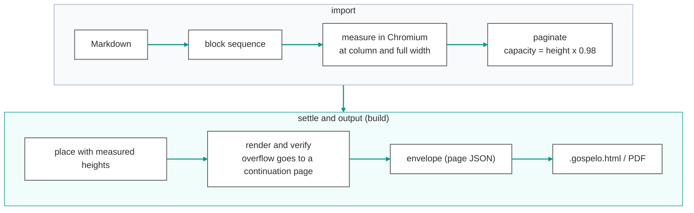
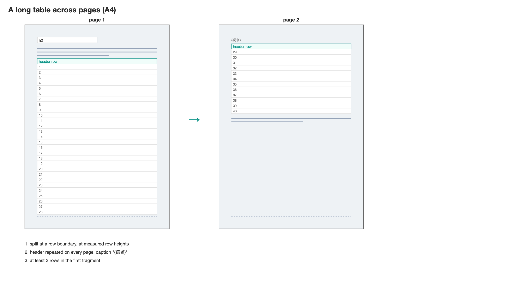

# Design rules of md2html

Pick one font size and the margins, headings and columns follow. This document explains the rules md2html uses when it lays Markdown out as slides or documents, and what those rules are based on. The bracketed keys ([S2], [W6] and so on) point to the references at the end.

日本語: [DESIGN_ja.md](DESIGN_ja.md)

## 1. One knob: the body size F

**The body size `F` is the only input.** Heading sizes, line height, spacing between blocks, the column gap, the header band and even the footer text are all derived as multiples of `F`. Only the outer margins are fixed millimetre values, following the conventions of each paper size.

> To change a proportion, change its factor of `F`. The moment a pixel value is written directly, the proportions break when the paper size changes.

| Element | Size | Rationale |
| --- | --- | --- |
| h1 / h2 / h3 / h4 | 1.6F / 1.35F / 1.15F / 1.0F bold | A restrained modular scale with steps of 1.15 to 1.2 [B1] [B2]. Headings grow by "the smallest increment that makes a visible difference" [B3]. At A4 11pt an h1 stays within 18pt |
| Body line height | 1.6 (documents) / 1.5 (slides) | Japanese line gap is between half an em and one em, that is a line height of 1.5 to 2.0 [S2] [W6]. Also satisfies the WCAG minimum of 1.5 [W7]. Slides sit at the lower bound to fit more lines |
| Tables / code | 0.9F (0.85F on slides) / 0.85F monospace | Dense elements one step smaller, distinct from body text. The same ratio as 10pt body with 9pt figure text in standards documents [G3] |
| Slide title | 1.25F | The smallest difference that reads as "a little larger than the body" (17.5pt against 14pt). A major third in musical terms [B2] |

### Slides are set as documents to be read

**The 14pt body is a value for reading at a desk.** md2html slides are document-style: read on a screen or printed on A4 and handed out, not projected in a lecture hall. Legibility depends on visual angle, not absolute size, and the standards treat desk work (viewing distance 400 to 750 mm) and projection (2 to 10 m) as separate regimes [S7] [S8]. On a 300 mm wide display viewed from 500 mm, 14pt text subtends 21 arc minutes, inside the recommended band of 20 to 22. Printed on A4 landscape it becomes 12.3pt, which meets the universal-design threshold for print (12pt or larger) [G5] [G11]. Japanese government briefing decks in 16:9 use 14 to 16pt body text in practice [G14].

> "18pt or larger" [V2] and "24pt or larger" [G8] assume projection distance. For a large room, pass `--font-size 24pt` or more.

## 2. The page: conventions outside, multiples of F inside

**The margin from the paper edge to the text is fixed per paper size.** Print and slides have different conventions, so this is the one place not derived from `F`. Top and bottom margins are equal, and the bottom margin doubles as the footer band.

*Drawn to scale from the tool's own page metrics (`assets/design/make_figures.py`). The grey frame is the margin; the footer sits inside the bottom margin.*

| Paper | Top / bottom | Sides | Share of width | Origin |
| --- | --- | --- | --- | --- |
| A4 portrait | 18mm | 18mm | 8.6% | Office convention. At 11pt this gives 44 characters per line and 42 lines, close to the Japanese public-document guideline (35 to 45 characters, 30 to 40 lines) [G4]. Single-sided PDF, so no binding margin |
| A4 landscape | 16mm | 20mm | 6.7% | Wider sides make each of the two columns a tall page |
| A3 portrait / landscape | 22mm / 20mm | 22mm / 24mm | 7.4% | 1.4 times A4, in proportion to the area |
| 16:9 / 4:3 | 10mm | 12mm | 3.5% | Keeps content clear of the edge that projection may crop; the same as broadcast safe areas (action 3.5%, graphics 5%) [S3] |

Paper sizes follow ISO 216 [S1] and PowerPoint's Widescreen / 4:3 [V1]; millimetres convert to pixels at the CSS 1in = 96px [W1].

> The footer text is `min(0.75F, 0.36 x bottom margin)`, so it never leaves the band however large the body is.

**Fonts that embed into PDF come first.** The Japanese body font stack starts with BIZ UDPGothic, then falls back to Hiragino Kaku Gothic ProN and Noto Sans JP. BIZ UD is a universal-design typeface shipped with Windows 10 and later, and being a glyf TrueType it is subsetted and embedded by Chromium's PDF writer. The CFF-based Hiragino cannot be embedded; Chromium substitutes Osaka-Mono and embeds all 2.2 MB of it unsubsetted (a 15-page deck produced a 2.3 MB PDF, 0.4 MB with BIZ UD). The code and inline-code stacks include BIZ UDGothic for the same reason, and Mermaid diagram text uses the body stack. BIZ UD comes in two weights only, Regular (400) and Bold (700), so the 600 requested for headings and slide titles resolves to 700; the weight's job is to set headings apart from the body, and that is still met. The default stacks can be replaced with `--font-family` and `--code-font-family`; the choice is recorded in the envelope's `layout`.

**The document carries its own glyphs.** Subsets of the bundled BIZ UD fonts (SIL OFL), cut to the characters the document uses, are embedded in the head as `@font-face` data URIs: Regular for body text, Bold only for headings, table headers and strong spans, and the monospaced BIZ UDGothic only for code. The measurement pass uses the same subsets, so pagination is independent of the fonts installed on the building machine, and a reader without BIZ UD sees the same glyphs; the PDF embeds those subsets instead of a system font (the 15-page deck: HTML 0.46 to 0.77 MB, PDF 0.40 to 0.24 MB). `--no-embed-fonts` turns this off.

## 3. Vertical rhythm: the proximity principle

**Space above and below an element is asymmetric.** A heading has more space above than below, which shows that it belongs to the text that follows (the proximity principle [B5] [B6]). Headings are emphasised by space rather than by size [B3]. Tables and code take more space after them, drawing a boundary before the next paragraph. Every value is close to a multiple of the line height, which gives the page a steady rhythm [B4].

*Left: the scale, each sample set at its real size relative to F. Right: the vertical rhythm; teal bands are the space rules from the table below.*

| Element | Above | Below | Intent |
| --- | --- | --- | --- |
| Paragraph | 0 | 0.7F | Just under half a line: a visible break without a skipped line |
| h2 | 1.8F | 0.6F | 3 : 1 |
| h3 | 1.4F | 0.4F | Smaller space as the level goes down |
| h4 | 1.0F | 0.3F | |
| Table / code / quote | 0.5F | 1.0F | More space after a block |
| Figure | 0 | 1.0F | Caption at 0.8F, 0.3F below the figure |

> A heading never ends a page on its own. It reserves the next two or three lines of text (or the whole figure) before it is placed [W6] [B8].

## 4. Columns: line length decides

**Landscape paper defaults to two columns.** A single column would be 63 full-width characters per line, far beyond the 40-character maximum for horizontal Japanese [S2] [W6] [W7]. Two columns give 31, close to the 20 to 29 characters at which Japanese reading speed peaks [R2]. The gap is 1.5F, the same as the line height: the smallest distance that keeps the eye from jumping to the neighbouring column (between the JIS default of 2F [S2] and the CSS default of 1em [W5]).

Reading order is column order (left column, then right): down the left column, then down the right (columns in horizontal writing run left to right [W6] [G7]). Traced on the page the path forms a mirrored N, the Cyrillic И. Alternating Z order is rejected because the eye would jump mid-paragraph. Elements that need the full width close the columns and become a band, after which the two columns resume. A figure that does not fit at the bottom of the left column floats to the top of an empty right column while the text keeps flowing on the left (block 4 above).

| Paper | Column width | Gap | Characters per line |
| --- | --- | --- | --- |
| 16:9 (14pt) | 580px | 28px | 31 |
| 4:3 (14pt) | 420px | 28px | 22 |
| A4 landscape (11pt) | 474px | 22px | 32 |
| A3 landscape (12pt) | 691px | 24px | 43 |

## 5. Where a figure goes: the scale decides

**A figure goes into a column or a band depending on where it renders larger.** The tool compares the scale factor needed to fit the column box (column width x column height) with the one for the band box (full width x 0.6 of the height) and picks the larger. There is no fixed aspect-ratio threshold.

> On 16:9 a figure wider than about 1.67 times its height becomes a band; on A4 landscape the break-even is about 1.17. The threshold follows from the paper size.

The band height is capped at 0.6 so that a few lines of two-column text still fit below the figure (LaTeX's defaults are a 0.7 float cap and 0.2 minimum text [B10]). For a figure-only slide, raise `maxHeightRatio` in the layout `overrides`.

## 6. Measure, do not estimate

**Every height used for pagination is measured in Chromium.** Line counts of paragraphs, row heights of tables and figure sizes are rendered and read back, never estimated. Pages are filled with the measured heights, then rendered again and verified.

> Pages are filled to 98% of their height and verified at 100%. The remaining 2% absorbs differences between rendering environments.

## 7. To split or not to split

**A block is cut only where the pieces still read.** Tables split at rows, lists at items, paragraphs at lines, code at lines. Figures and quotes are never split. If a fragment would be too small, the whole block moves to the next page instead.

| Block | Split at | Smallest fragment |
| --- | --- | --- |
| Paragraph | measured line positions | 2 lines on each side (the CSS `orphans` / `widows` initial value [W2]) |
| List | items; numbering continues | 1 item |
| Table | rows; the header is repeated and the fragment marked "(続き)" [W4]. However many pages the table spans, every page starts with the header (a 180-row table becomes 7 A4 pages of 23 to 27 rows) | 3 rows in the first fragment; not split if the whole table fits on one page |
| Code | lines | 3 lines on each side; up to 15 lines is never split |
| Figure / quote / html | never | |

> Nothing is deleted to make content fit. Whatever overflows moves to a continuation page with the same title and is written back into the envelope.

Two cases cannot be split. A table whose single row is taller than the page (a huge cell) cannot be cut inside the row; it is placed with a warning. And when the verify pass repairs an overflow, it cuts at measured row heights and does not apply the three-row minimum, which holds only for the initial pagination.

## 8. What was rejected

- **Golden-ratio and canon-based page construction.** Designed around the diagonals and binding margin of a two-page spread [B12]; it does not fit single-sided PDFs and slides.
- **Strict snapping to a baseline grid.** A grid must be divided by whole empty lines [B7], and tables and Mermaid diagrams do not land on it. With measured heights, keeping spacing close to multiples of the line height is enough.
- **Z-order two columns.** The eye would jump left and right mid-paragraph; columns in horizontal writing read left to right [W6].
- **Shipping the Mermaid library in every file.** Diagrams are drawn during the build and written as SVG; the source stays in the envelope, so they remain editable (edit, then `build`) without a 3 MB library in each file. `--mermaid-lib embed` keeps browser-side drawing as an option.

## 9. Where the numbers live

| Decision | Location (under `skills/claude/gospelo-md2html/`) |
| --- | --- |
| Paper sizes, outer margins, default font sizes | `scripts/md2html/formats.py` |
| Everything derived from F (line height, bands, column width, figure boxes) | `scripts/md2html/scale.py` |
| Inner spacing and type scale (CSS calc) | `references/base.css` |
| Band rules, minimum fragments, column balancing | `scripts/md2html/paginate.py` |
| Figure sizing formula | `references/figures.js` |
| Rule summaries for agents | `references/page_formats.md`, `references/layout_rules.md` |
| File format | `docs/spec/gospelo-document.md`, `docs/ARCHITECTURE.md` |

## References

Standards

- [S1] ISO 216:2007. Writing paper and certain classes of printed matter. Trimmed sizes. A and B series. https://www.iso.org/standard/36631.html
- [S2] JIS X 4051:2004. Formatting rules for Japanese documents. Japanese Standards Association.
- [S3] EBU R 95. Safe areas for 16:9 television production. Version 1.1, 2017. https://tech.ebu.ch/docs/r/r095.pdf
- [S7] ISO 9241-303:2011. Ergonomics of human-system interaction. Part 303: Requirements for electronic visual displays.
- [S8] ISO 9241-306:2008. Ergonomics of human-system interaction. Part 306: Field assessment methods for electronic visual displays.

W3C

- [W1] CSS Values and Units Module Level 4, 6.2 Absolute Lengths. https://www.w3.org/TR/css-values-4/#absolute-lengths
- [W2] CSS Fragmentation Module Level 3, 3.3 Breaks Between Lines. https://www.w3.org/TR/css-break-3/
- [W4] CSS 2.1, 17.2 The CSS table model. https://www.w3.org/TR/CSS21/tables.html#table-display
- [W5] CSS Multi-column Layout Module Level 1, 4.1 column-gap. https://www.w3.org/TR/css-multicol-1/
- [W6] Requirements for Japanese Text Layout, 2.3.2, 2.4.2, 4.1.4, 4.1.7. https://www.w3.org/TR/jlreq/
- [W7] Web Content Accessibility Guidelines (WCAG) 2.1, SC 1.4.8, 1.4.12. https://www.w3.org/TR/WCAG21/

Public guidelines (Japan)

- [G3] Ministry of Agriculture, Forestry and Fisheries. Guide to the format of JAS standard sheets, Annex L. https://www.maff.go.jp/j/jas/attach/pdf/jas_consul-2.pdf
- [G4] Chatan Town. Public document drafting guideline. https://www.chatan.jp/reiki/reiki_honbun/q925RG00000736.html
- [G5] Tokyo Metropolitan Government, Bureau of Social Welfare. TOKYO Universal Design Guideline (visual information), 2025. https://www.fukushi.metro.tokyo.lg.jp/documents/d/fukushi/tokyouniversaldesignguideline-pdf
- [G7] Japan Federation of Printing Industries. Printing glossary, "column setting". https://www.jfpi.or.jp/webyogo/index.php?term=1438
- [G8] Osaka University, Center for Education in Liberal Arts and Sciences. Teaching methods series 2: Lecturing (slides). https://www.tlsc.osaka-u.ac.jp/support_e_learning/
- [G11] Municipal universal-design guidelines (12 to 14pt for A4 print): Mie Prefecture https://www.pref.mie.lg.jp/common/content/000837583.pdf , Nakano, Nerima, Adachi, Kyoto
- [G14] Measured font sizes in government briefing decks: METI advisory council material https://www.meti.go.jp/shingikai/economy/global_industrial_strategy/pdf/003_01_00.pdf , FSA Financial System Council working group material https://www.fsa.go.jp/singi/singi_kinyu/disclosure_wg/shiryou/20250826/03.pdf

Vendor documentation

- [V1] Microsoft Support. Change the size of your PowerPoint slides. https://support.microsoft.com/en-us/office/change-the-size-of-your-slides-040a811c-be43-40b9-8d04-0de5ed79987e
- [V2] Microsoft Support. Tips for creating and delivering an effective presentation. https://support.microsoft.com/en-us/office/tips-for-creating-and-delivering-an-effective-presentation-f43156b0-20d2-4c51-8345-0c337cefb88b

Books and papers

- [B1] Brown, Tim. "More Meaningful Typography." A List Apart, 2011. https://alistapart.com/article/more-meaningful-typography/
- [B2] Brown, Tim, and Scott Kellum. Modular Scale. https://www.modularscale.com/
- [B3] Butterick, Matthew. Practical Typography, 2nd ed. https://practicaltypography.com/
- [B4] Bringhurst, Robert. The Elements of Typographic Style, version 4.0. Hartley & Marks, 2012. Section 2.2.2.
- [B5] Williams, Robin. The Non-Designer's Design Book, 4th ed. Peachpit Press, 2015.
- [B6] Wertheimer, Max. "Untersuchungen zur Lehre von der Gestalt II." Psychologische Forschung 4 (1923): 301-350.
- [B7] Müller-Brockmann, Josef. Grid Systems in Graphic Design. Niggli, 1981.
- [B8] The University of Chicago Press. Turabian Tip Sheet 7. https://www.chicagomanualofstyle.org/dam/jcr:134b5b19-bdc9-4d69-b4ad-0aa19fdc3730/Turabian-Tip-Sheet-7.pdf
- [B10] LaTeX Project. classes.dtx, float parameters. https://github.com/latex3/latex2e/blob/develop/base/classes.dtx
- [B12] Tschichold, Jan. The Form of the Book. Hartley & Marks, 1991. "Consistent Correlation Between Book Page and Type Area."
- [R2] Kobayashi, Jumpei, et al. "Optimal line length for Japanese e-readers based on reading speed and eye movement." IEICE Transactions D, J99-D(1), 2016 (in Japanese). https://doi.org/10.14923/transinfj.2015HAP0014
