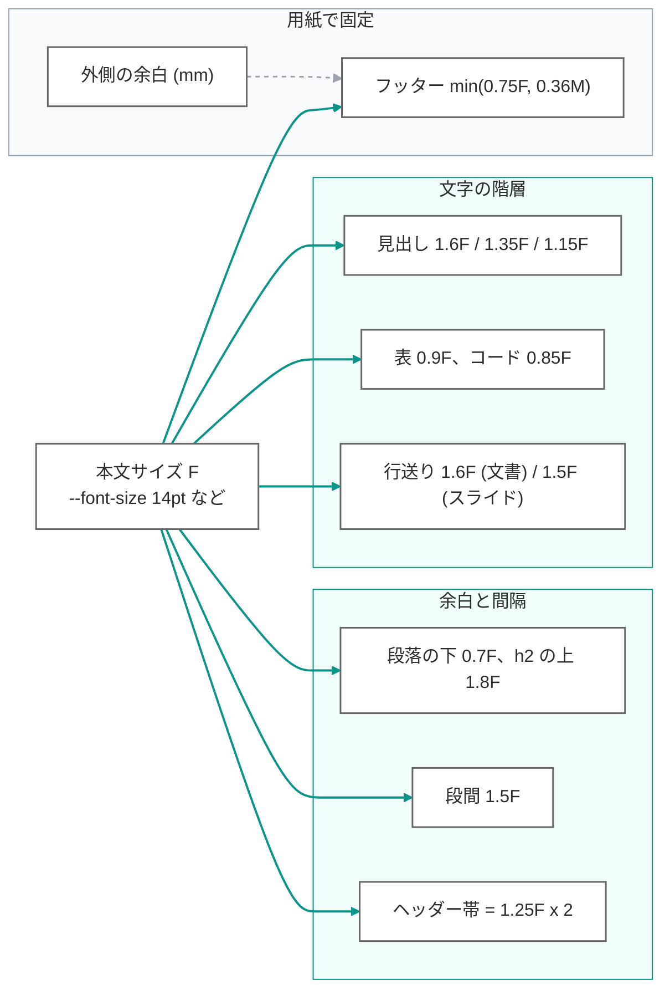
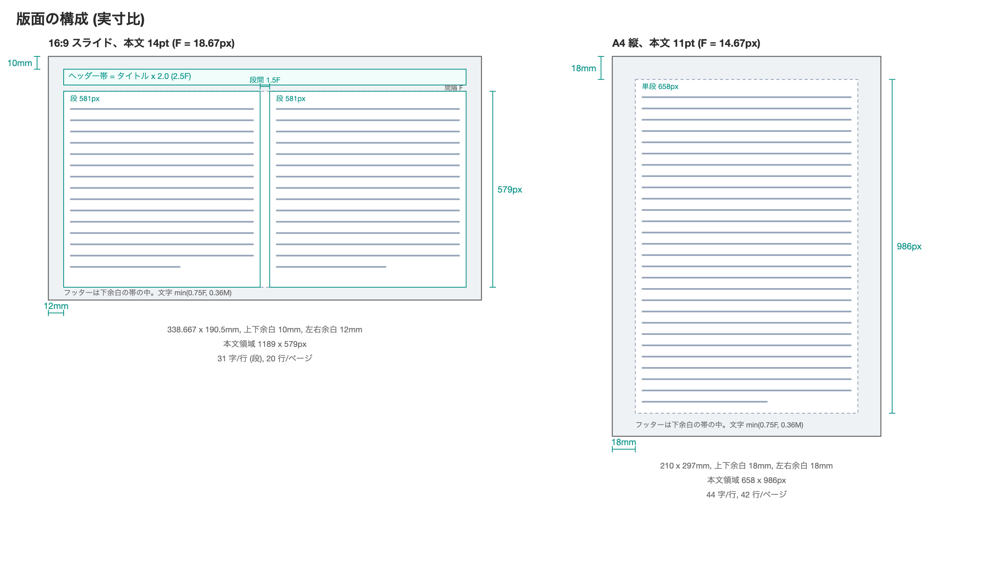
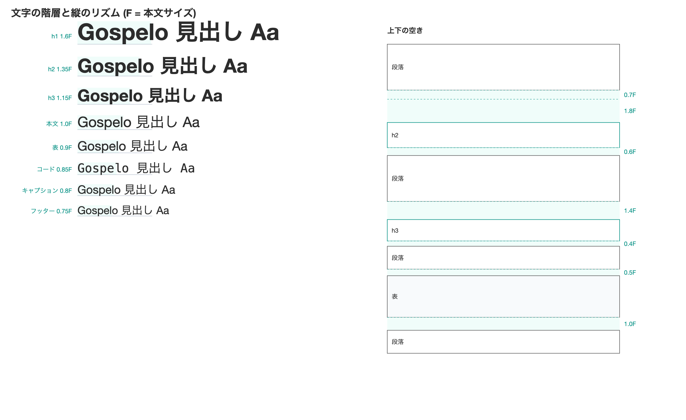
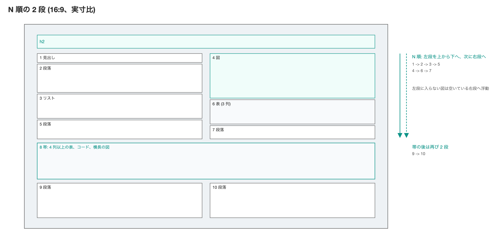
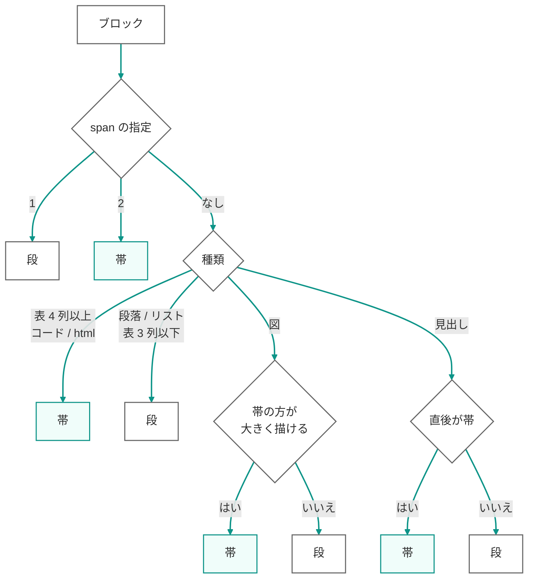
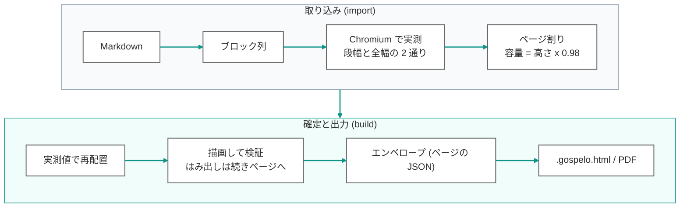
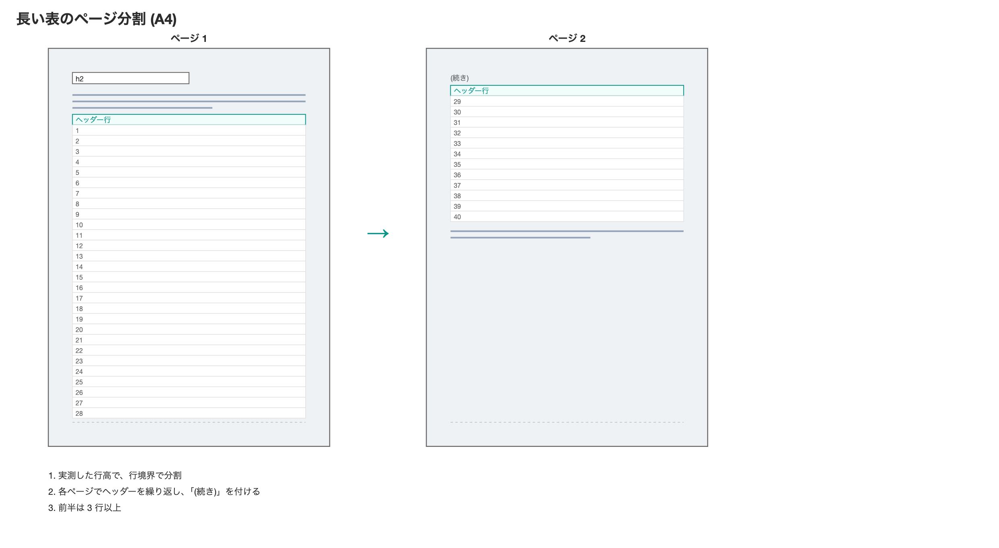

# md2html のデザインルール

文字サイズをひとつ決めれば、余白も見出しも段組も決まる。md2html が Markdown をスライドや文書に組むとき、どんな規則で紙面を作っているのか、その規則を何に基づいて決めたのかをまとめる。各節の根拠に添えた記号 ([S2]、[W6] など) は末尾の参考文献に対応する。

English: [DESIGN.md](DESIGN.md)

## 1. つまみは 1 つ: 文字サイズ F

**本文サイズ `F` だけが入力。** 見出しの大きさ、行送り、ブロック間の余白、段間、ヘッダー帯、フッターの文字まで、紙面の寸法はすべて `F` の倍数として導かれる。用紙の外側の余白だけは mm の固定値で、用紙の慣習に従う。

> 倍率を変えたいときは `F` の係数だけを触る。px を直接書いた瞬間に、用紙を変えたとき比率が崩れる。

| 要素 | 文字サイズ | 根拠 |
| --- | --- | --- |
| h1 / h2 / h3 / h4 | 1.6F / 1.35F / 1.15F / 1.0F 太字 | ステップ 1.15 〜 1.2 倍の控えめなモジュラースケール [B1] [B2]。見出しは「目に見える差が出る最小の増分」で大きくする [B3]。A4 11pt で h1 が 18pt に収まる |
| 本文の行送り | 1.6 (文書) / 1.5 (スライド) | 日本語の行間は文字サイズの二分アキ以上全角アキ以下、つまり行送り 1.5 〜 2.0 倍 [S2] [W6]。WCAG の 1.5 倍以上も満たす [W7]。スライドは行数を稼ぐため下限に寄せる |
| 表 / コード | 0.9F (スライドは 0.85F) / 0.85F 等幅 | 密度の高い要素は一段小さく、本文と区別する。本文 10pt に図表 9pt という規格票の慣行と同じ比 [G3] |
| スライドのタイトル | 1.25F | 「本文より少し大きめ」の最小の差 (14pt に対して 17.5pt)。音程でいう major third [B2] |

### スライドは「読む資料」として組む

**本文 14pt は机上で読む前提の値。** md2html のスライドは画面で読むか A4 に印刷して配る資料型で、大会場に投影する発表型ではない。可読性は文字の絶対サイズではなく視角で決まり、規格は事務作業の視距離 (400 〜 750mm) と投影 (2 〜 10m) を別の領域として扱う [S7] [S8]。幅 300mm の画面を 500mm から見るとき 14pt の文字高は視角 21 分で推奨帯 (20 〜 22 分) に入る。A4 横に印刷すると 12.3pt になり、印刷物の UD 基準 (12pt 以上) を満たす [G5] [G11]。官公庁の説明資料も 16:9 で本文 14 〜 16pt が実態である [G14]。

> 「18pt 以上」[V2] や「24pt 以上」[G8] は投影距離を前提にした値。大会場で投影するなら `--font-size 24pt` 以上を指定する。

## 2. 版面: 外は用紙の慣習、内は文字の倍数

**紙の縁から本文までの余白は用紙ごとの固定値。** 印刷とスライドでは慣習が違うので、ここだけは `F` から導かない。上下の余白は同じ高さにし、下余白をそのままフッターの帯として使う。

*ツール自身の寸法から実寸比で描いた図 (`assets/design/make_figures.py`)。灰色の枠が余白で、フッターは下余白の中に置く。*

| 用紙 | 上下 | 左右 | 用紙幅比 | 由来 |
| --- | --- | --- | --- | --- |
| A4 縦 | 18mm | 18mm | 8.6% | オフィス文書の慣習。11pt で 1 行 44 字、42 行になり、公用文の目安 (35 〜 45 字、30 〜 40 行) に近い [G4]。片面 PDF なので綴じ代は取らない |
| A4 横 | 16mm | 20mm | 6.7% | 左右を広めに取り、2 段の各段を縦長の版面にする |
| A3 縦 / 横 | 22mm / 20mm | 22mm / 24mm | 7.4% | A4 の 1.4 倍。面積に比例させる |
| 16:9 / 4:3 | 10mm | 12mm | 3.5% | 投影で画面端が切れる分を空ける。放送のセーフエリア (アクション 3.5%、グラフィックス 5%) と同じ [S3] |

用紙の寸法は ISO 216 [S1] と PowerPoint の Widescreen / 4:3 [V1] に合わせ、mm から px への換算は CSS の 1in = 96px [W1] に従う。

> フッターの文字は `min(0.75F, 0.36 x 下余白)`。本文を大きくしても帯からはみ出さない。

## 3. 縦のリズム: 近接の原則

**要素の上下の余白は非対称。** 見出しは上を広く下を狭くして「次の本文に属する」ことを示す (近接の原則 [B5] [B6])。見出しの強調は文字サイズよりも上下の空きで行う [B3]。表やコードは後ろを広く取り、次の段落との境界を作る。値はどれも行送りの倍数に近く、紙面に一定のリズムが生まれる [B4]。

*左: 文字の階層。各見本は F に対する実際の比率で組んである。右: 縦のリズム。ティールの帯が下の表の空きの規則。*

| 要素 | 上 | 下 | 意図 |
| --- | --- | --- | --- |
| 段落 | 0 | 0.7F | 行送りの半分弱。切れ目は分かるが行は飛ばない |
| h2 | 1.8F | 0.6F | 上 3 : 下 1 |
| h3 | 1.4F | 0.4F | 階層が下がるほど余白も小さく |
| h4 | 1.0F | 0.3F | |
| 表 / コード / 引用 | 0.5F | 1.0F | 塊の後ろを広く |
| 図 | 0 | 1.0F | キャプションは 0.3F 下に 0.8F で |

> 見出しだけがページ末尾に残ることはない。見出しは次の本文 2 〜 3 行分 (図なら図の全高) を予約してからページに入る [W6] [B8]。

## 4. 段組: 行長から余白を決める

**横長の用紙は 2 段が既定。** 単段では 1 行が全角 63 文字になり、横組の上限 40 文字 [S2] [W6] [W7] を大きく超える。2 段にすると 1 行 31 文字に収まり、日本語の読み速度が最も高い 20 〜 29 文字 [R2] に近づく。段間は行送りと同じ 1.5F で、目が隣の段に飛ばない最小の間隔にする (JIS の既定 2F [S2] と CSS の既定 1em [W5] の間)。

読み順は 2 段組 (左段 → 右段)。左段を上から下へ読み切ってから右段に移る (横組の段は左から右に配置する [W6] [G7])。紙面上でなぞると左右反転の N、キリル文字の И の形になる。左右交互の Z 順は、段落の途中で視線が飛ぶので採用しない。幅の要る要素は段を閉じて幅いっぱいの帯になり、帯の後でまた 2 段に戻る。左段の末尾に入らない図は、空いている右段の先頭に浮動し、テキストは左段に流れ続ける (上図のブロック 4)。

| 用紙 | 段幅 | 段間 | 1 行の文字数 |
| --- | --- | --- | --- |
| 16:9 (14pt) | 580px | 28px | 31 |
| 4:3 (14pt) | 420px | 28px | 22 |
| A4 横 (11pt) | 474px | 22px | 32 |
| A3 横 (12pt) | 691px | 24px | 43 |

## 5. 図の置き場所: 縮小率で決める

**図を段に入れるか帯にするかは、どちらが大きく描けるかで決める。** 段の枠 (段幅 x 段の高さ) と帯の枠 (全幅 x 高さの 0.6) にそれぞれ収めたときの縮小率を比べ、大きい方を選ぶ。固定の縦横比しきい値は持たない。

> 16:9 では幅が高さの約 1.67 倍より横長なら帯、A4 横では約 1.17 倍。損益分岐は用紙の寸法から自動で決まる。

帯の高さ上限を 0.6 にしているのは、図の下に本文が 2 段で数行入る余地を残すため (LaTeX の既定はフロート上限 0.7、本文最小 0.2 [B10])。図だけのスライドにしたいときはレイアウトの `overrides` で `maxHeightRatio` を上げる。

## 6. 実測で割る: 推定しない

**ページ割りの高さはすべて Chromium の実測値。** 段落の行数も表の行の高さも図の大きさも推定せず、描画して測る。測った高さで割り付け、描画し直して検証する。

> ページは高さの 98% まで詰め、検証は 100% で行う。残り 2% は描画環境の差を吸収する遊び。

## 7. 分けるか、分けないか

**ブロックの途中で切るのは、切っても読めるものだけ。** 表は行、リストは項目、段落は行、コードは行で分ける。図と引用は分けない。分けた断片が小さすぎるなら、分けずに丸ごと次へ送る。

| ブロック | 分け方 | 最小の断片 |
| --- | --- | --- |
| 段落 | 実測した行の位置 | 両側 2 行 (CSS の `orphans` / `widows` の初期値と同じ [W2]) |
| リスト | 項目。番号は引き継ぐ | 1 項目 |
| 表 | 行。ヘッダーを繰り返し「(続き)」[W4]。何ページにまたがっても各ページの先頭でヘッダーを繰り返す (180 行の表は A4 で 7 ページ、各ページ 23 〜 27 行) | 前半 3 行。全体が 1 ページに入るなら分けない |
| コード | 行 | 両側 3 行。15 行以下は分けない |
| 図 / 引用 / html | 分けない | |

> 内容を削ってページに収めることはしない。収まらない分は同じタイトルの「(続き)」ページへ送り、エンベロープに書き戻す。

分割できない場合が 2 つある。1 行がページの高さを超える表 (巨大なセル) は行の途中で切れないので、警告を出してそのまま置く。また、検証パスがはみ出しを直すときの再分割は実測の行高で切る位置を決めるため、「前半 3 行」の下限は初回のページ割りにだけ効く。

## 8. 採用しなかったもの

- **黄金比や canon による版面。** 見開きの対角線と綴じ代を前提にした設計で [B12]、片面の PDF とスライドには合わない。
- **ベースライングリッドへの厳密な吸着。** グリッドは完全な空行で区切る必要があり [B7]、表や Mermaid の高さはグリッドに乗らない。実測で割るなら、余白を「倍数に近い値」に保つだけで十分。
- **Z 順の 2 段。** 段落の途中で視線が左右に飛ぶ。横組の段は左から右へ読む [W6]。
- **Mermaid ライブラリの全ファイルへの同梱。** 図はビルド時に描いて SVG として書き込み、ソースはエンベロープに残す。図は編集できたまま (直して `build`)、各ファイルに 3 MB のライブラリを持たずに済む。`--mermaid-lib embed` でブラウザ描画も選べる。

## 9. 数値の在り処

| 決めていること | 場所 (`skills/claude/gospelo-md2html/` 配下) |
| --- | --- |
| 用紙の寸法、外側の余白、既定の文字サイズ | `scripts/md2html/formats.py` |
| F からの派生 (行送り、帯、段幅、図の枠) | `scripts/md2html/scale.py` |
| 内側の余白と文字倍率 (CSS の calc) | `references/base.css` |
| 帯にする条件、分割の最小単位、段の高さ揃え | `scripts/md2html/paginate.py` |
| 図の表示サイズの式 | `references/figures.js` |
| 規則の要約 (エージェント向け) | `references/page_formats.md`、`references/layout_rules.md` |
| ファイル形式 | `docs/spec/gospelo-document_ja.md`、`docs/ARCHITECTURE_ja.md` |

## 参考文献

規格

- [S1] ISO 216:2007. Writing paper and certain classes of printed matter. Trimmed sizes. A and B series. https://www.iso.org/standard/36631.html
- [S2] JIS X 4051:2004. 日本語文書の組版方法. 日本規格協会.
- [S3] EBU R 95. Safe areas for 16:9 television production. Version 1.1, 2017. https://tech.ebu.ch/docs/r/r095.pdf
- [S7] ISO 9241-303:2011. Ergonomics of human-system interaction. Part 303: Requirements for electronic visual displays.
- [S8] ISO 9241-306:2008. Ergonomics of human-system interaction. Part 306: Field assessment methods for electronic visual displays.

W3C

- [W1] CSS Values and Units Module Level 4, 6.2 Absolute Lengths. https://www.w3.org/TR/css-values-4/#absolute-lengths
- [W2] CSS Fragmentation Module Level 3, 3.3 Breaks Between Lines. https://www.w3.org/TR/css-break-3/
- [W4] CSS 2.1, 17.2 The CSS table model. https://www.w3.org/TR/CSS21/tables.html#table-display
- [W5] CSS Multi-column Layout Module Level 1, 4.1 column-gap. https://www.w3.org/TR/css-multicol-1/
- [W6] Requirements for Japanese Text Layout (日本語組版処理の要件), 2.3.2、2.4.2、4.1.4、4.1.7. https://www.w3.org/TR/jlreq/
- [W7] Web Content Accessibility Guidelines (WCAG) 2.1, SC 1.4.8、1.4.12. https://www.w3.org/TR/WCAG21/

公的ガイドライン

- [G3] 農林水産省. 日本農林規格の規格票の様式及び作成方法に関する手引き, 附属書 L. https://www.maff.go.jp/j/jas/attach/pdf/jas_consul-2.pdf
- [G4] 北谷町. 公用文作成要領. https://www.chatan.jp/reiki/reiki_honbun/q925RG00000736.html
- [G5] 東京都福祉局. TOKYO ユニバーサルデザインガイドライン (視覚情報版), 2025. https://www.fukushi.metro.tokyo.lg.jp/documents/d/fukushi/tokyouniversaldesignguideline-pdf
- [G7] 日本印刷産業連合会. 印刷用語集「段組み」. https://www.jfpi.or.jp/webyogo/index.php?term=1438
- [G8] 大阪大学 全学教育推進機構. シリーズ 大学の教授法 2 講義法 (スライド). https://www.tlsc.osaka-u.ac.jp/support_e_learning/
- [G11] 自治体の UD ガイドライン (A4 印刷物 12 〜 14pt): 三重県 https://www.pref.mie.lg.jp/common/content/000837583.pdf 、中野区、練馬区、足立区、京都市
- [G14] 官公庁説明資料のフォントサイズ実測: 経済産業省 有識者会議 資料 https://www.meti.go.jp/shingikai/economy/global_industrial_strategy/pdf/003_01_00.pdf 、金融庁 金融審議会 WG 資料 https://www.fsa.go.jp/singi/singi_kinyu/disclosure_wg/shiryou/20250826/03.pdf

ベンダー資料

- [V1] Microsoft Support. Change the size of your PowerPoint slides. https://support.microsoft.com/en-us/office/change-the-size-of-your-slides-040a811c-be43-40b9-8d04-0de5ed79987e
- [V2] Microsoft Support. Tips for creating and delivering an effective presentation. https://support.microsoft.com/en-us/office/tips-for-creating-and-delivering-an-effective-presentation-f43156b0-20d2-4c51-8345-0c337cefb88b

書籍と論文

- [B1] Brown, Tim. "More Meaningful Typography." A List Apart, 2011. https://alistapart.com/article/more-meaningful-typography/
- [B2] Brown, Tim, and Scott Kellum. Modular Scale. https://www.modularscale.com/
- [B3] Butterick, Matthew. Practical Typography, 2nd ed. https://practicaltypography.com/
- [B4] Bringhurst, Robert. The Elements of Typographic Style, version 4.0. Hartley & Marks, 2012. 2.2.2.
- [B5] Williams, Robin. The Non-Designer's Design Book, 4th ed. Peachpit Press, 2015.
- [B6] Wertheimer, Max. "Untersuchungen zur Lehre von der Gestalt II." Psychologische Forschung 4 (1923): 301-350.
- [B7] Müller-Brockmann, Josef. Grid Systems in Graphic Design. Niggli, 1981.
- [B8] The University of Chicago Press. Turabian Tip Sheet 7. https://www.chicagomanualofstyle.org/dam/jcr:134b5b19-bdc9-4d69-b4ad-0aa19fdc3730/Turabian-Tip-Sheet-7.pdf
- [B10] LaTeX Project. classes.dtx, float parameters. https://github.com/latex3/latex2e/blob/develop/base/classes.dtx
- [B12] Tschichold, Jan. The Form of the Book. Hartley & Marks, 1991. "Consistent Correlation Between Book Page and Type Area."
- [R2] 小林潤平ほか. 「日本語リーダーにおける読み速度と眼球運動の行長依存性に基づく最適行長の検討」. 電子情報通信学会論文誌 D, J99-D(1), 2016. https://doi.org/10.14923/transinfj.2015HAP0014
