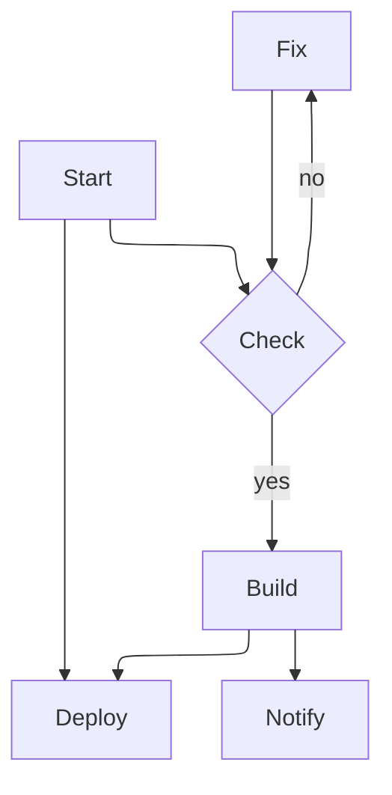
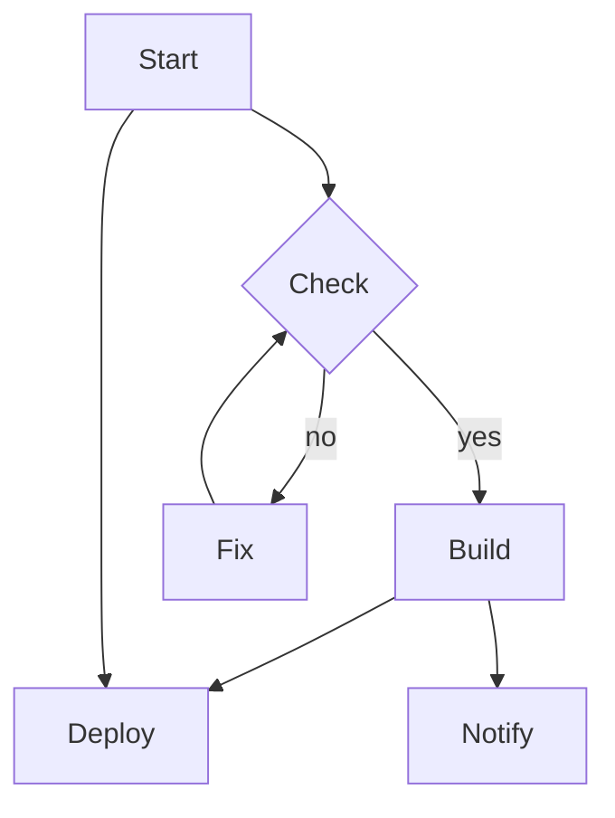

# ELK layout

The same graph four times: three ways of asking for the ELK layout, and the
default (dagre) for comparison.

## init directive

```mermaid
%%{init: {"layout": "elk"}}%%
flowchart TD
  A[Start] --> B{Check}
  B -->|yes| C[Build]
  B -->|no| D[Fix]
  D --> B
  C --> E[Deploy]
  A --> E
  C --> F[Notify]
```

## front matter

```mermaid
---
config:
  layout: elk
---
flowchart TD
  A[Start] --> B{Check}
  B -->|yes| C[Build]
  B -->|no| D[Fix]
  D --> B
  C --> E[Deploy]
  A --> E
  C --> F[Notify]
```

## flowchart-elk

```mermaid
flowchart-elk TD
  A[Start] --> B{Check}
  B -->|yes| C[Build]
  B -->|no| D[Fix]
  D --> B
  C --> E[Deploy]
  A --> E
  C --> F[Notify]
```

## default layout

```mermaid
flowchart TD
  A[Start] --> B{Check}
  B -->|yes| C[Build]
  B -->|no| D[Fix]
  D --> B
  C --> E[Deploy]
  A --> E
  C --> F[Notify]
```
