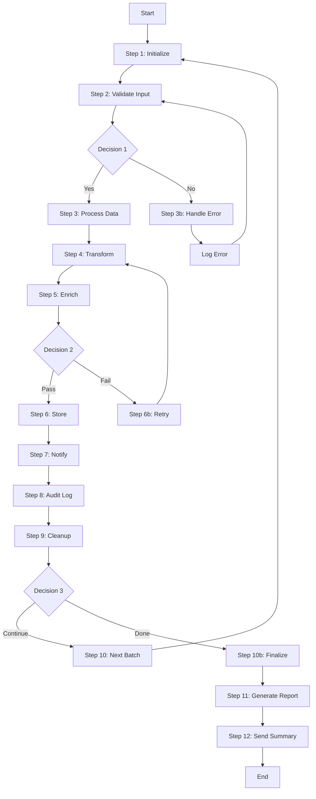

# Tall Flowchart Test

## Process Flow

```mermaid
flowchart TD
    A[Start] --> B[Step 1: Initialize]
    B --> C[Step 2: Validate Input]
    C --> D{Decision 1}
    D -->|Yes| E[Step 3: Process Data]
    D -->|No| F[Step 3b: Handle Error]
    F --> G[Log Error]
    G --> C
    E --> H[Step 4: Transform]
    H --> I[Step 5: Enrich]
    I --> J{Decision 2}
    J -->|Pass| K[Step 6: Store]
    J -->|Fail| L[Step 6b: Retry]
    L --> H
    K --> M[Step 7: Notify]
    M --> N[Step 8: Audit Log]
    N --> O[Step 9: Cleanup]
    O --> P{Decision 3}
    P -->|Continue| Q[Step 10: Next Batch]
    P -->|Done| R[Step 10b: Finalize]
    Q --> B
    R --> S[Step 11: Generate Report]
    S --> T[Step 12: Send Summary]
    T --> U[End]
```

Some text after the diagram.
